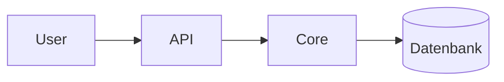

# Dokumentations-Standard (Google-Grade)

Ein normativer Standard für Repository-Dokumentation: messbar, profilabhängig und an den
aktuellen Google-Dokumentationsmustern ausgerichtet. Dieser Standard ist der Maßstab, gegen den
das [`documentation-audit`](audit-prompts/documentation-audit-master-prompt.md) beliebige Repos
prüft und konkrete Verbesserungs-Issues erzeugt.

> [!NOTE]
> **Management-Summary.** Dieser Standard definiert, wie eine erstklassige README und die
> umgebende Repo-Dokumentation aufgebaut sind: ein aussagekräftiger Repo-Kopf
> (Nutzenversprechen, Badges, Management-Summary, Architektur-Diagramm), ein Diátaxis-bewusster
> Rumpf, vollständige Repo-Health-Dateien und durchgehend Google-konforme Schreibregeln. Er ist
> in fünf **Profile** gestaffelt (Bibliothek, Anwendung, Service, CLI, Monorepo) und liefert eine
> **0–100-Bewertungsrubrik** mit Notenstufen. Englische Spiegelfassung:
> [`DOCUMENTATION-STANDARD.en.md`](DOCUMENTATION-STANDARD.en.md).

Version 1.0.0 · Sprache: Deutsch (kanonisch), Englisch (Spiegel) · Lizenz: MIT

---

## Inhalt

- [0. Geltungsbereich und Profile](#0-geltungsbereich-und-profile)
- [1. Der Repo-Kopf (head-matter)](#1-der-repo-kopf-head-matter)
- [2. Der Rumpf (Diátaxis-bewusst)](#2-der-rumpf-diátaxis-bewusst)
- [3. Repo-Health](#3-repo-health)
- [4. Schreibregeln (Google)](#4-schreibregeln-google)
- [5. Barrierefreiheit und Emoji-Politik](#5-barrierefreiheit-und-emoji-politik)
- [6. Bewertungs-Rubrik (0–100)](#6-bewertungs-rubrik-0100)
- [7. Konformitäts-Checkliste](#7-konformitäts-checkliste)
- [8. Quellen](#8-quellen)

---

## Designgrundsatz: „Google-Grade" ist eine bewusste Synthese

Dieser Standard übernimmt **Googles Schreib- und Barrierefreiheits-Disziplin** sowie die
**Design-Doc-Strenge** (Kontext, Ziele, Nicht-Ziele, Trade-offs) — und ergänzt sie um den
**Repo-Kopf**, den Googles eigene, minimalistische READMEs bewusst weglassen: Badges, ein
Management-Summary und ein Architektur-Diagramm. Diese Mischung ist gewollt:

- **Von Google:** Stimme, zweite Person, Präsens, Aktiv, satzweise Großschreibung der
  Überschriften, parallele Listen, Geltungsbereich + Zielgruppe zuerst nennen, strikte
  Barrierefreiheit. (Quelle: Google developer documentation style guide, tech-writing.)
- **Von Best-in-Class-OSS:** Badge-Reihe (shields.io), Management-Summary/TL;DR, Mermaid-
  Architektur-Diagramm, Diátaxis-Abdeckung, GitHub-Community-Standards, SemVer, Keep a Changelog,
  docs-as-code. (Quelle: Standard-Readme, shields.io, Mermaid, Diátaxis, OpenSSF.)

> [!IMPORTANT]
> Wo dieser Standard über Googles Minimalismus hinausgeht (Badges, Diagramme im Kopf), ist das
> Absicht. „Google-Grade" meint die **Qualität der Sprache und Struktur**, nicht das Kopieren von
> Googles sparsamem README-Stil.

---

## 0. Geltungsbereich und Profile

**Audience-first.** Jede README nennt zuerst, *für wen* sie ist und *was* das Projekt leistet.
Ein fremder Entwickler erkennt in unter 30 Sekunden: Was ist das? Für wen? Warum nützlich?

**Profile.** Der Kern dieses Standards gilt immer. Profile passen an, welche Abschnitte
**erforderlich**, **empfohlen** oder **nicht anwendbar** sind, und gewichten die Rubrik um.

| Profil | Typische Beispiele | Profil-Schwerpunkte (zusätzlich erforderlich) |
|---|---|---|
| Bibliothek / SDK | npm/PyPI-Paket, Client-SDK | API-Referenz, Installations-Matrix, semantische Versionierung |
| Anwendung | Web-App, Desktop-App | Screenshots/Demo, Setup-Pfad, Konfiguration, Deployment |
| Service / API | Microservice, REST/GraphQL-Backend | Architektur-Diagramm, Runbooks, Betriebs-/SLO-Doku, Endpunkt-Referenz |
| CLI-Werkzeug | Kommandozeilen-Tool | Befehls-Referenz, Beispiele pro Befehl, Exit-Codes, Installation |
| Monorepo | Workspace mit mehreren Paketen | Paket-Übersichtstabelle, paketweise READMEs, Querverweise, Werkzeugkette |

**Nicht-anwendbar wird deklariert, nicht verschwiegen.** Fehlt ein Abschnitt, weil das Profil ihn
nicht braucht, wird das vermerkt (z. B. „kein Deployment — reine Bibliothek"). Ein fehlender
Pflicht-Abschnitt ohne Begründung ist ein Befund.

---

## 1. Der Repo-Kopf (head-matter)

Der Kopf entscheidet, ob ein Leser bleibt. Reihenfolge (verbindlich):

1. **Titel + Ein-Satz-Nutzenversprechen.** Projektname als `# H1`, **ohne Emoji**. Direkt darunter
   ein Satz: was es tut und für wen.
2. **Badge-Reihe.** 5–10 Badges, logisch gruppiert, direkt unter dem Titel. Standard-Taxonomie:
   CI/Status → Coverage → Version/Release → Lizenz → Sprache/Laufzeit → Docs → Last-commit.
   shields.io-Muster: `https://img.shields.io/badge/<label>-<message>-<color>` (statisch) oder die
   dienstspezifischen dynamischen Badges. Maximal ~10 — Über-Badging ist ein Anti-Muster.
3. **Management-Summary.** 3–5 Sätze in einer `> [!NOTE]`-Box: Was ist das? Welches Problem löst es?
   Für wen? Warum ist es besser/relevant? Lesbar auch für Nicht-Spezialisten.
4. **Architektur-/Übersichts-Diagramm (Mermaid).** Caption-first: zuerst die Aussage formulieren,
   dann das Diagramm bauen, das sie am besten zeigt. GitHub rendert Mermaid nativ — keine
   veralteten PNGs. Informationsdichte begrenzen (≈ 5 Blöcke / ein Konzept-Cluster); für
   Komplexes erst das Big Picture, dann Subsystem-Diagramme. Geeignete Typen: `flowchart`,
   `C4Context`/`C4Container`, `sequenceDiagram`, `erDiagram`.
5. **Inhaltsverzeichnis.** Ab ~100 Zeilen README. Beschreibende Linktexte, funktionierende Anker.

> [!TIP]
> Das C4-Modell hilft beim Schichten von Architektur: **Context** (System + Außenwelt) →
> **Container** (Apps, DBs, APIs) → **Component** (Inneres eines Containers). Im Repo-Kopf gehört
> in der Regel ein Context- oder schlankes Container-Diagramm.

Beispiel für eine Badge-Reihe und einen Kopf-Diagramm-Block:

```markdown
# projektname

Eine Bibliothek, die <Problem> für <Zielgruppe> löst.


> [!NOTE]
> **Management-Summary.** <3–5 Sätze.>


```

---

## 2. Der Rumpf (Diátaxis-bewusst)

Das **Diátaxis-Modell** trennt vier Dokumenttypen nach Leserbedürfnis. Eine reife Doku deckt alle
vier ab (sofern das Profil sie braucht) und **vermischt sie nicht**:

| Typ | Leser will … | Form |
|---|---|---|
| Tutorial | lernen | geführte, garantiert funktionierende Lektion |
| How-to-Guide | eine Aufgabe lösen | zielgerichtete Schritte |
| Referenz | nachschlagen | präzise, vollständige Faktentabellen |
| Erklärung | verstehen | Hintergrund, Trade-offs, Warum |

Empfohlene Rumpf-Abschnitte (Profil entscheidet über Pflicht/optional):

- **Overview / Hintergrund.** Ziele und **Nicht-Ziele** (aus dem Google-Design-Doc-Muster).
- **Quickstart.** Code-first, copy-paste-fähig, auf kürzeste **Time-to-first-success** optimiert.
- **Usage / Beispiele.** Die häufigsten Anwendungsfälle mit lauffähigen Beispielen.
- **Configuration / Referenz.** Alle Optionen, Env-Variablen, Flags, API-/CLI-Referenz.
- **Architecture & Design.** Tiefe + Trade-offs; Verweis auf `ARCHITECTURE.md` und ADRs.
- **Development / Testing / Contributing.** Lokales Setup, Tests, Beitragspfad.
- **Deployment / Operations / Runbooks.** Für Service-Profile: Betrieb, Rollback, SLOs.
- **Roadmap / Changelog / Versioning.** Verweis auf `CHANGELOG.md`, SemVer-Politik.
- **Security / License / Maintainers.** Sicherheitskontakt, Lizenz, Verantwortliche.

---

## 3. Repo-Health

Über die README hinaus erwartet dieser Standard die GitHub-Community-Standard-Dateien. Sie sind
Teil der Bewertung, weil sie Beitrag, Betrieb und Vertrauen tragen.

- **`LICENSE`** — eindeutige Lizenz (z. B. MIT, Apache-2.0).
- **`CONTRIBUTING.md`** — Setup, Branch-/PR-/Commit-Konventionen, Test-/Lint-Befehle.
- **`CODE_OF_CONDUCT.md`** — Verhaltensstandard (für öffentliche Projekte).
- **`SECURITY.md`** — Meldeweg für Schwachstellen.
- **`CHANGELOG.md`** — Format nach [Keep a Changelog]; je Release ein Eintrag.
- **Issue-/PR-Templates** unter `.github/` — strukturierte Beiträge.
- **`ARCHITECTURE.md` / ADRs** — Entwurfsentscheidungen mit Trade-offs.
- **Repo-Beschreibung + Topics** in den Repo-Einstellungen.

**SemVer.** Versionen folgen `MAJOR.MINOR.PATCH` ([semver.org]); jeder Bump paart sich mit einem
Changelog-Eintrag und einem annotierten Git-Tag.

**Docs-as-code.** Dokumentation lebt im Git neben dem Code, durchläuft PR-Review und wird in CI
geprüft: Link-Check (null tolerierte tote Links), Markdown-Lint, und — wo möglich — Ausführen der
Code-Beispiele (ReadmeOps). Die Build-Stufe bricht bei Doku-Fehlern ab.

---

## 4. Schreibregeln (Google)

Diese Regeln stammen direkt aus dem Google developer documentation style guide und den
tech-writing-Kursen. Sie gelten für jede Markdown-Datei im Repo.

- **Zweite Person.** Sprich den Leser mit „du/Sie" an, nicht „wir". „Wir" nur für die
  herausgebende Organisation, mit klarem Bezug.
- **Präsens.** Beschreibe Verhalten im Präsens („Der Server sendet …"), nicht im Futur/Konjunktiv.
- **Aktiv.** Aktiv statt Passiv; nenne, wer handelt. Passiv nur, wenn der Akteur irrelevant ist.
- **Überschriften in Satz-Schreibweise.** Kein Title Case, kein Versal-Satz. Aufgaben-
  Überschriften als Infinitiv („Instanz erstellen"), konzeptuelle als Nominalphrase. Genau **eine
  H1** pro Dokument; keine übersprungenen Ebenen.
- **Parallele Listen.** Alle Punkte einer Liste in gleicher Struktur. Nummeriert für Reihenfolge,
  Aufzählung für Optionen. Keine Liste mit nur einem Punkt.
- **Geltungsbereich + Zielgruppe zuerst.** Jedes Dokument nennt am Anfang Ziel und Leserschaft;
  Kernaussagen stehen vorn („bottom line up front").
- **Terminologie konsistent.** Ein Begriff je Konzept; keine Synonyme für dasselbe Element.
- **Abkürzungen** bei Erstnennung ausschreiben (Ausnahme: allgemein bekannte wie API, HTML, URL,
  AI). Keine Punkte in Akronymen.
- **Kurze Sätze, ein Gedanke pro Absatz.** „Curse of knowledge" vermeiden: nichts voraussetzen,
  was die Zielgruppe nicht kennt.
- **Code-Blöcke.** Sprache am Fence angeben; Einrückung 2 Leerzeichen; Zeilen ~80 Zeichen;
  ausgelassenen Code per sprachspezifischem Kommentar markieren, nicht per „…".
- **Caption-first bei Abbildungen.** Erst die Bildunterschrift/Aussage, dann das Bild; Callouts
  statt langer Fließtext-Erklärungen.

---

## 5. Barrierefreiheit und Emoji-Politik

Barrierefreiheit ist nicht optional. Dokumentation muss mit Screenreader und Tastatur nutzbar sein.

- **Alt-Text** für jedes informative Bild; leerer Alt-Text nur für rein dekorative Bilder.
- **Keine Information ausschließlich über Bilder** vermitteln.
- **Keine Richtungssprache.** „vorstehend/folgend/weiter oben im Text" statt „oben/unten/rechts" —
  Layout variiert je nach Gerät und Screenreader.
- **Kontrast** mindestens 4.5:1 für Text.
- **Information nie nur über Farbe oder Emoji** kodieren; immer ein Textlabel als primären Träger.

### Emoji-Politik (verbindlich)

> [!IMPORTANT]
> **Keine Emojis in Titeln oder Überschriften.** Keine dekorativen Emoji-Reihen (z. B. ein buntes
> Symbol je Tabellenzeile). Emojis sind nur dort erlaubt, wo sie eine **echte Funktion** erfüllen
> und nie der alleinige Informationsträger sind.

Begründung: Screenreader lesen Emojis als Wörter vor („sparkles", „rocket") und Information darf
nie allein an einem Symbol hängen (4.5:1- und „nicht nur Farbe/Symbol"-Regel). Dekoratives Emoji
erhöht den Lärm und senkt die Scanbarkeit.

**Stattdessen: GitHub-Alerts** für Hinweise — sie sind text-basiert, barrierefrei und konsistent:

```markdown
> [!NOTE] Allgemeiner Hinweis.
> [!TIP] Optionaler, hilfreicher Tipp.
> [!IMPORTANT] Wichtig für den Erfolg.
> [!WARNING] Vorsicht, mögliches Problem.
> [!CAUTION] Riskante/destruktive Folge.
```

Wenn ein kleines, **konsistentes funktionales** Symbolset doch nötig ist (z. B. ein einzelnes
Status-Zeichen), wird es dokumentiert, sparsam eingesetzt und immer von Text begleitet.

---

## 6. Bewertungs-Rubrik (0–100)

Das Audit vergibt Punkte je Dimension und bildet eine Gesamtnote. Profile gewichten um (siehe
Hinweis unter der Tabelle).

| Dimension | Punkte | Geprüft wird |
|---|---|---|
| Repo-Kopf | 20 | Titel + Nutzensatz, gruppierte Badge-Reihe (5–10), Management-Summary, Architektur-Diagramm (Mermaid), Inhaltsverzeichnis |
| Getting started | 15 | Voraussetzungen, Quickstart, copy-paste-Beispiele, Time-to-first-success, Troubleshooting |
| Usage und Referenz | 15 | Feature-Nutzung, Config-/API-/CLI-Referenz, reale Beispiele |
| Schreibqualität (Google) | 15 | Satz-Schreibweise, zweite Person, Präsens/Aktiv, parallele Listen, Scope+Zielgruppe zuerst, Terminologie |
| Diátaxis-Abdeckung | 10 | Tutorial / How-to / Referenz / Erklärung — soweit profilrelevant vorhanden |
| Repo-Health | 10 | LICENSE, CONTRIBUTING, CoC, SECURITY, Issue-/PR-Templates, Repo-Beschreibung |
| Wartbarkeit | 10 | SemVer + CHANGELOG, docs-as-code-CI (Link-Check/Lint/Sample-Test), Aktualität, keine toten Links |
| Barrierefreiheit und Stil | 5 | Alt-Text, keine Richtungssprache, 4.5:1, **Emoji-Politik** eingehalten |

**Notenstufen:** Gold 90–100 · Silver 75–89 · Bronze 60–74 · Needs-work 40–59 · Inadequate < 40.

**Profil-Gewichtung (Beispiele):** Service/API verschiebt Punkte zu Runbooks/Betrieb unter „Usage
und Referenz"; Bibliothek betont API-Referenz; CLI betont Befehls-Referenz. Die Summe bleibt 100;
nicht anwendbare Teilkriterien werden anteilig auf die verbleibenden verteilt und im Bericht
ausgewiesen.

**Severity-Mapping für Issues:**

- **P0 — Kritisch:** Kopf führt aktiv in die Irre (falsches Quickstart), kein lauffähiger
  Einstieg, fehlende Lizenz.
- **P1 — Hoch:** kein Management-Summary, kein Architektur-Diagramm wo Profil es verlangt,
  undokumentiertes Kern-Feature, fehlende Pflicht-Health-Datei.
- **P2 — Mittel:** Drift, schwache Navigation, inkonsistente Terminologie, dünne Referenz.
- **P3 — Niedrig:** Stil, Tippfehler, Emoji-Politik-Verstöße ohne Informationsverlust.

Die Befunde werden nach dem [`ISSUE-OUTPUT-STANDARD.md`](ISSUE-OUTPUT-STANDARD.md) ausgegeben:
zuerst ein Tracking-Issue (priorisierter Index + Management-Summary + Roadmap), dann pro Befund
ein Issue mit eigener Management-Summary.

---

## 7. Konformitäts-Checkliste

Eine README/ein Repo gilt als konform, wenn:

- [ ] Titel ohne Emoji, mit Ein-Satz-Nutzenversprechen.
- [ ] Badge-Reihe (5–10, gruppiert) direkt unter dem Titel.
- [ ] Management-Summary als `> [!NOTE]`-Box im Kopf.
- [ ] Architektur-/Übersichts-Diagramm (Mermaid), caption-first, rendert auf GitHub.
- [ ] Inhaltsverzeichnis (ab ~100 Zeilen) mit funktionierenden Ankern.
- [ ] Quickstart führt nachweislich von null zum ersten Erfolg.
- [ ] Diátaxis-Typen profilgerecht abgedeckt und nicht vermischt.
- [ ] Repo-Health-Dateien vorhanden (LICENSE, CONTRIBUTING, CoC, SECURITY, CHANGELOG, Templates).
- [ ] SemVer + Changelog gepflegt; docs-as-code-Checks in CI.
- [ ] Schreibregeln eingehalten (zweite Person, Präsens, Aktiv, Satz-Überschriften, parallele Listen).
- [ ] Barrierefreiheit + Emoji-Politik eingehalten (keine Emojis in Überschriften, Alerts statt Emoji).
- [ ] Keine toten Links; keine Doku-Code-Drift.

---

## 8. Quellen

**Google**

- Google developer documentation style guide — https://developers.google.com/style
  (voice, person, tense, headings, lists, tables, abbreviations, accessibility)
- Google Technical Writing One/Two — https://developers.google.com/tech-writing
- Google styleguide, docguide/READMEs.md — https://github.com/google/styleguide
- Design Docs at Google — https://www.industrialempathy.com/posts/design-docs-at-google/

**Best-in-Class-OSS**

- Standard-Readme — https://github.com/RichardLitt/standard-readme
- Make a README — https://makeareadme.com
- shields.io — https://shields.io/docs/
- Mermaid C4 — https://mermaid.js.org/syntax/c4.html
- Diátaxis — https://diataxis.fr/
- GitHub Community Standards — https://docs.github.com/communities
- Semantic Versioning — https://semver.org/
- Keep a Changelog — https://keepachangelog.com/
- OpenSSF Best Practices Badge — https://best.openssf.org/

[Keep a Changelog]: https://keepachangelog.com/
[semver.org]: https://semver.org/
