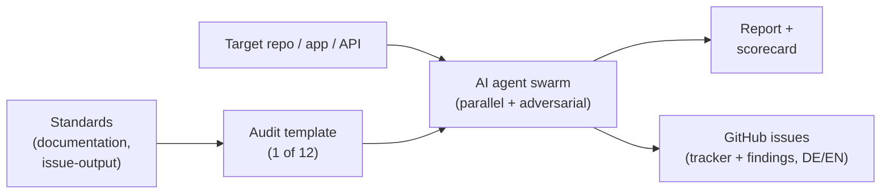
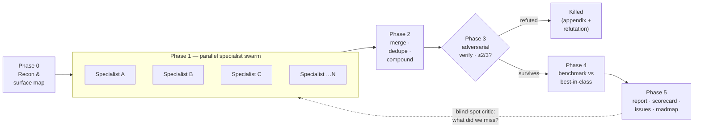

# auditor

Master prompts that turn any AI coding agent into a swarm of specialist auditors — for security,
engineering, frontend, API, performance, data, infrastructure, AI/LLM, compliance, accessibility,
documentation, and content.

[](https://github.com/marcelrapold/auditor/releases)
[](LICENSE)
[](https://github.com/marcelrapold/auditor/commits)
[](audit-prompts)
[](DOCUMENTATION-STANDARD.md)
[](ISSUE-OUTPUT-STANDARD.md)
[](https://auditor.rapold.io)

> [!NOTE]
> **Management summary.** `auditor` is a library of 12 reusable "master prompt" audit templates
> plus the standards that govern their output. You point one at a repository, app, website, API,
> datastore, or infrastructure; it runs a parallel swarm of specialist agents, adversarially
> verifies every finding, scores the result, and files **GitHub issues** (German or English) — led
> by a single priority-sorted tracking issue. It exists because most "audit my code" prompts return vague,
> unverified opinions; these enforce evidence, self-challenge, and an actionable 30/60/90 roadmap.

> [!NOTE]
> **Kurzfassung (DE).** Wiederverwendbare Master-Prompts für die tiefe, parallelisierte
> Durchleuchtung von Repos, Apps, APIs, Daten und Infrastruktur. Viele Agenten arbeiten
> gleichzeitig, **challengen ihre Ergebnisse adversariell**, decken blinde Flecken auf und öffnen
> am Ende **GitHub-Issues auf Deutsch** — zuerst ein nach Priorität sortiertes Tracking-Issue,
> dann pro Befund ein Ticket mit eigener Management-Summary.

*Figure 1. How auditor works: a standard plus a template guide an AI agent swarm over a target,
producing a scored report and GitHub issues (German or English).*



---

## Contents

- [Overview](#overview)
- [The audit library](#the-audit-library)
- [Run it from your AI agent](#run-it-from-your-ai-agent)
- [Worked example: auditing this repo](#worked-example-auditing-this-repo)
- [Quickstart](#quickstart)
- [How it works](#how-it-works)
- [Issue output](#issue-output)
- [Standards](#standards)
- [Read-only and authorization](#read-only-and-authorization)
- [Repository layout](#repository-layout)
- [Contributing](#contributing)
- [Changelog and license](#changelog-and-license)

---

## Overview

Every prompt in this repo enforces the same engineering discipline a top-tier review board would
demand:

- **Evidence or it didn't happen.** Every finding cites a concrete artifact — `file:line`, a query
  plan, a request/response, a config value, a measured metric. No evidence means it is discarded.
- **Adversarial self-challenge.** No finding survives until independent skeptic agents have tried
  to refute it. This is the strongest defense against the false positives that make most AI audits
  useless.
- **Blind-spot hunting.** A completeness critic asks each round which surface, use-case, or
  assumption was not examined. Unchecked areas are declared, never hidden.
- **Maximum parallelism.** Work fans out across many specialist agents at once (Claude Code
  `ultracode` / Workflow mode), then pipelines per-finding verification.
- **A standardized procedure.** Every audit runs the same phases and maps findings to recognized
  standards (OWASP, CWE, MITRE ATT&CK, WCAG, CIS, DORA, RFCs, GDPR).
- **Actionable output.** A severity-scored register, a 30/60/90 roadmap, and GitHub issues (German
  or English) led by a priority-sorted tracker.

The bar is "Google-grade": precise, reproducible, no panic, no hand-waving, every recommendation
immediately actionable.

## The audit library

All templates are stack-, framework-, and product-agnostic and share one methodology, so findings
compose cleanly when you run several against the same target.

> [!NOTE]
> **Terminology.** Each audit ships as a *master prompt* — a self-contained *template* you paste
> into your AI agent. This README uses "audit", "template", and "master prompt" for the same
> artifact; "audit" names what it does, "template/master prompt" names the file you copy.

| Template | Audits | Maps to | Output |
|---|---|---|---|
| [`security`](audit-prompts/security-audit-master-prompt.md) | Security across 14 domains: injection, authN/authZ, secrets, supply chain, IaC, CI/CD, API, business logic, privacy, LLM | OWASP Top 10 / API / ASVS / LLM, CWE-25, MITRE ATT&CK, CIS, GDPR | Issues + scorecard (DE/EN) |
| [`repo`](audit-prompts/repo-audit-master-prompt.md) | Whole-repo engineering: architecture, stack consistency, docs, tests, deps, CI/CD, observability, git hygiene | Google Eng Practices, SRE, SLSA, OWASP | Board-ready report |
| [`frontend`](audit-prompts/frontend-audit-master-prompt.md) | 16-agent frontend sweep: usability, psychology, visual design, a11y, performance, SEO, copy, CRO, IA, forms, trust | Nielsen, WCAG 2.2, Core Web Vitals | Prioritized backlog + scorecard |
| [`api`](audit-prompts/api-audit-master-prompt.md) | API design: resource modeling, HTTP semantics, error model, versioning, idempotency, rate limits, schema, DX | RFC 9110/9457, OpenAPI 3.1, GraphQL, Google AIP | Contract-drift matrix + roadmap |
| [`performance`](audit-prompts/performance-audit-master-prompt.md) | Performance & scalability: hotspots, N+1, caching, concurrency, leaks, load behavior, resilience, FinOps | SRE practice, DORA, load/latency SLOs | Bottleneck map + per-fix metric gains |
| [`data`](audit-prompts/data-audit-master-prompt.md) | Data & database: modeling, types, constraints, migration safety, transactions, integrity, backup/DR | Normalization, ACID/CAP, RLS, expand/contract | Entity-risk map + safe migration plan |
| [`infrastructure`](audit-prompts/infrastructure-audit-master-prompt.md) | Infra/DevOps/SRE: IaC, cloud security, IAM, secrets, containers, k8s, CI/CD, HA, DR, observability, cost | CIS Benchmarks, Well-Architected, SLSA, DORA | Blast-radius map + roadmap |
| [`ai-llm`](audit-prompts/ai-llm-audit-master-prompt.md) | AI/LLM: prompt injection, jailbreaks, output handling, agent/tool safety, RAG, hallucination, evals, cost | OWASP LLM Top 10, NIST AI RMF | Trust-boundary map + guardrail/eval tracks |
| [`compliance-privacy`](audit-prompts/compliance-privacy-audit-master-prompt.md) | Privacy: lawful basis, consent/cookies, data-subject rights, retention, transfers, breach readiness | GDPR, ePrivacy/TTDSG, EU AI Act, CCPA, HIPAA/PCI | RoPA/data-flow map + article-mapped roadmap |
| [`accessibility`](audit-prompts/accessibility-audit-master-prompt.md) | Deep a11y: semantics, keyboard, focus, screen reader, contrast, forms, zoom, motor, motion, cognitive | WCAG 2.2 AA/AAA, EAA 2025, EN 301 549, ADA/508 | WCAG conformance table + roadmap |
| [`documentation`](audit-prompts/documentation-audit-master-prompt.md) | Docs quality vs the standard: head-matter, onboarding, doc–code drift, writing, Diátaxis, repo-health | DOCUMENTATION-STANDARD.md, Diátaxis, Google style | Rubric scorecard + German issues |
| [`content`](audit-prompts/content-audit-master-prompt.md) | Content & messaging: thesis challenge, audience fit, evidence & originality, structure, voice, line-level rewrites | E-E-A-T, BLUF, awareness stages, rhetoric | Scorecard + before/after rewrites |

> [!NOTE]
> **Acronyms.** DX = developer experience · CRO = conversion-rate optimization · IA = information
> architecture · RLS = row-level security · FinOps = cloud-cost engineering · RoPA = Records of
> Processing Activities · DAST = dynamic application security testing.

## Run it from your AI agent

Point any capable agent at the live entry point — no install:

> Audit `github.com/your/repo` using **auditor.rapold.io**

The agent fetches the orchestrator
([`full-audit-master-prompt.md`](audit-prompts/full-audit-master-prompt.md), surfaced at
[`auditor.rapold.io/llms.txt`](https://auditor.rapold.io/llms.txt)), asks your output language
(Deutsch / English) and which audits to run (or the full repo), then files a consolidated,
priority-sorted issue backlog.

## Worked example: auditing this repo

The library is dogfooded on itself. Running the orchestrator end-to-end against `auditor` produced
a consolidated, cross-audit backlog — a concrete trace of the input-to-issues loop:

- **Input.** Point the agent at the repo. Phase 0 recon selected the seven applicable audits and
  declared four **not applicable, with reasons** (no runtime API, no database, no in-repo LLM
  runtime, no personal data) rather than skipping them silently.
- **Scorecard.** documentation A (94), accessibility A (93), performance A (92), security A (91),
  repo / frontend / infrastructure A- (90) — zero P0, one P1.
- **Cross-audit dedupe.** "`CHECKSUMS.txt` is not verified in CI" was found independently by the
  repo, infrastructure, and security lenses and merged into a single backlog item with all three
  citations — the payoff of running the audits together.
- **Output.** One master tracking issue plus one issue per finding, each with a management summary,
  evidence (`file:line`), a before/after fix, an effort estimate, and a re-audit criterion.

See the run on GitHub: [master tracker #97](https://github.com/marcelrapold/auditor/issues/97)
(scorecard, consolidated backlog, and a 30/60/90 roadmap) and the per-finding issues it links.

## Quickstart

> [!TIP]
> Claude Code with `ultracode` or Workflow mode unlocks the real multi-agent parallelism. Any
> capable agent also works single-threaded — it runs the same phases sequentially.

**Prerequisites:** a capable AI coding agent; the [GitHub CLI](https://cli.github.com) (`gh`)
installed and authenticated if you target a GitHub URL or want the audit to file issues; and write
access to the target repository for the issue phase.

1. **Open your AI coding agent** in the target's working directory, or give it a GitHub URL.
2. **Paste the chosen master prompt** in full (open the file on GitHub and use "Copy raw file"),
   then fill in the config block at its top — every prompt starts with one:

   ```text
   TARGET:       <local repo path or GitHub URL>
   SCOPE:        <whole repo | specific flows/paths>
   STACK:        <languages, frameworks, cloud — or let Phase 0 infer>
   AUDIENCE:     <who the target serves, if known>
   DATA_ACCESS:  <can run / active-test? or read-only>
   OUTPUT_LANG:  <Deutsch (default) | English | ...>
   ISSUE_TARGET: <owner/repo for issues — preview-first, on approval>
   ```
3. **Let it run.** It builds a fact sheet, fans out specialist agents, cross-pollinates and
   dedupes, adversarially verifies every serious finding, benchmarks against best-in-class, then
   synthesizes the report and roadmap.
4. **Review the issues.** Each audit previews a priority-sorted tracking issue plus one issue per
   finding (in your chosen language), and creates them only on your explicit approval.

To get the full picture of a production system, run `repo` + `security` + `performance` + `data` +
`infrastructure` (and `frontend` / `api` / `ai-llm` / `compliance-privacy` / `accessibility` /
`documentation` where applicable). Each produces an independent report and issue set.

## How it works

Every template runs the same phases:

```
Phase 0  Reconnaissance      factual inventory + attack/surface map (no opinions yet)
Phase 1  Specialist swarm    many domain experts run IN PARALLEL, each evidence-bound
Phase 2  Cross-pollination   merge + dedupe + surface compound findings
Phase 3  Adversarial verify  independent skeptics try to REFUTE each P0/P1; ≥2/3 to survive
Phase 4  Benchmark           compare against named best-in-class references & standards
Phase 5  Synthesis           report, scorecard, issues, 30/60/90 roadmap
```

*Figure 2. The six-phase method: parallel specialists, then adversarial verification before
anything reaches the report.*



Severity is standardized (P0 critical to P3 polish), each finding carries an effort estimate and an
ICE/priority score, and the roadmap is
always Quick Wins → 30 → 60 → 90 days, dependency-aware, with finding IDs traced through. Every
report ends with an honest "Coverage and limitations" section; an unaudited area reported as
"fine" is treated as an audit failure.

## Issue output

After verification, every audit produces GitHub issues per
[`ISSUE-OUTPUT-STANDARD.md`](ISSUE-OUTPUT-STANDARD.md):

1. **A tracking issue first** — the index of all sub-tasks, sorted by priority (P0→P3), with a
   management summary, a scorecard, and the 30/60/90 roadmap. Each checklist line links its child
   issue.
2. **One issue per confirmed finding** — German, top-notch documented, each opening with its own
   management summary, then severity, evidence, a concrete before/after fix, effort, and a
   re-audit criterion.

Issues are German by default (configurable per run), preview-first, and created only on explicit
authorization.

## Standards

Two normative standards govern the audits and are reusable on their own:

- [`DOCUMENTATION-STANDARD.md`](DOCUMENTATION-STANDARD.md) (German) and
  [`DOCUMENTATION-STANDARD.en.md`](DOCUMENTATION-STANDARD.en.md) (English) — a Google-grade
  documentation standard with five repo profiles and a 0–100 scoring rubric. The `documentation`
  audit uses it as its yardstick.
- [`ISSUE-OUTPUT-STANDARD.md`](ISSUE-OUTPUT-STANDARD.md) — the mandatory tracking-issue +
  per-finding issue contract that every audit follows.

A ready-to-use README skeleton lives at [`templates/README.template.md`](templates/README.template.md).

## Read-only and authorization

These audits are non-destructive and read-only by default:

- Static analysis of code, config, schema, and IaC needs no special permission.
- Active or dynamic testing (DAST, load tests, injection/jailbreak probes, live cloud or DB
  access) requires explicit, documented authorization from the owner. Without it, the prompts fall
  back to static reasoning and flag the limitation.
- No destructive techniques, no DoS, no data exfiltration. Real secrets and PII are never copied
  into reports — location is cited and the value redacted.
- Creating issues is preview-first and gated on explicit approval.

Use these only on systems you own or are authorized to assess.

## Repository layout

```
auditor/
├── README.md                       you are here
├── ARCHITECTURE.md                 monorepo structure + design decisions
├── DOCUMENTATION-STANDARD.md       the doc standard (German, canonical)
├── DOCUMENTATION-STANDARD.en.md    the doc standard (English mirror)
├── ISSUE-OUTPUT-STANDARD.md        mandatory issue output for all audits
├── CONTRIBUTING.md                 how to contribute templates and docs
├── CODE_OF_CONDUCT.md              Contributor Covenant
├── SECURITY.md                     how to report a vulnerability
├── CHANGELOG.md                    Keep a Changelog format
├── templates/
│   └── README.template.md          canonical README skeleton
├── .github/
│   ├── workflows/docs.yml          docs CI (markdown lint, link-check, emoji guard)
│   ├── PULL_REQUEST_TEMPLATE.md
│   └── ISSUE_TEMPLATE/             findings + new-template + chooser config
├── web/                            landing page (Next.js 16) → auditor.rapold.io
└── audit-prompts/
    ├── full-audit-master-prompt.md                (orchestrator)
    ├── security-audit-master-prompt.md
    ├── repo-audit-master-prompt.md
    ├── frontend-audit-master-prompt.md
    ├── api-audit-master-prompt.md
    ├── performance-audit-master-prompt.md
    ├── data-audit-master-prompt.md
    ├── infrastructure-audit-master-prompt.md
    ├── ai-llm-audit-master-prompt.md
    ├── compliance-privacy-audit-master-prompt.md
    ├── accessibility-audit-master-prompt.md
    └── documentation-audit-master-prompt.md
```

The landing page lives in `web/` — its stack, local development, and deployment are documented in
[`web/README.md`](web/README.md).

## Contributing

New templates follow the house structure so they compose with the rest: Mission + Universality,
operating principles, a P0–P3 severity scale, the Phase 0–5 pipeline, a shared finding schema, a
mandatory issue-output block, and a Definition of Done. Keep them provider-agnostic, map findings
to recognized standards, and make every recommendation immediately actionable. See
[`CONTRIBUTING.md`](CONTRIBUTING.md), and follow [`DOCUMENTATION-STANDARD.md`](DOCUMENTATION-STANDARD.md)
for all Markdown — including no emojis in headings.

## Changelog and license

Changes are recorded in [`CHANGELOG.md`](CHANGELOG.md) (Keep a Changelog; SemVer). Licensed under
MIT — see [`LICENSE`](LICENSE).
