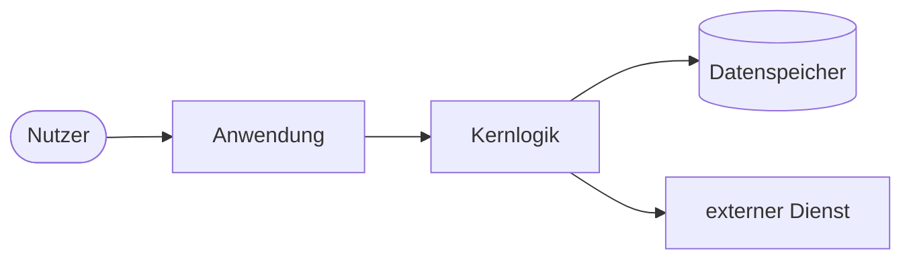

<!--
  README-Vorlage nach DOCUMENTATION-STANDARD.md (Google-Grade).
  Anleitung: Platzhalter <…> ersetzen, nicht zutreffende Abschnitte je Profil entfernen
  (und das Entfernen ggf. kurz begründen). Keine Emojis in Überschriften. Hinweise via
  GitHub-Alerts (> [!NOTE]/[!TIP]/[!WARNING]) statt Emoji.
  English note: replace <…> placeholders; drop sections your profile does not need.
-->

# <projektname>

<Ein Satz: was das Projekt für wen tut — das Nutzenversprechen.>

<!-- Badge-Reihe: 5–10, gruppiert. shields.io. owner/repo anpassen. -->
[](https://github.com/<owner>/<repo>/actions)
[](https://codecov.io/gh/<owner>/<repo>)
[](https://github.com/<owner>/<repo>/releases)
[](LICENSE)
[](https://github.com/<owner>/<repo>/commits)

> [!NOTE]
> **Management-Summary.** <3–5 Sätze: Was ist das? Welches Problem löst es? Für wen? Warum ist
> es besser/relevant? Lesbar auch für Nicht-Spezialisten.>



*Abbildung 1. <Ein-Satz-Bildunterschrift, die die Architektur-Aussage benennt.>*

---

## Inhalt

- [Überblick](#überblick)
- [Quickstart](#quickstart)
- [Nutzung](#nutzung)
- [Konfiguration / Referenz](#konfiguration--referenz)
- [Architektur und Design](#architektur-und-design)
- [Entwicklung](#entwicklung)
- [Roadmap und Changelog](#roadmap-und-changelog)
- [Sicherheit](#sicherheit)
- [Lizenz](#lizenz)

---

## Überblick

**Zielgruppe:** <wer nutzt das>. **Geltungsbereich:** <was dieses Dokument abdeckt>.

**Ziele:** <was das Projekt leistet.>
**Nicht-Ziele:** <was es bewusst nicht leistet — verhindert falsche Erwartungen.>

<Hintergrund: das Problem, der Kontext, der Ansatz in 1–2 Absätzen.>

## Quickstart

> [!TIP]
> Optimiere diesen Abschnitt auf die kürzeste Zeit bis zum ersten Erfolg. Code-first, copy-paste.

```bash
# Installation
<install-befehl>

# Erster Lauf
<run-befehl>
```

Erwartetes Ergebnis: <was der Leser jetzt sieht/hat>.

## Nutzung

<Die häufigsten Anwendungsfälle mit lauffähigen Beispielen.>

```<sprache>
<minimal lauffähiges Beispiel>
```

## Konfiguration / Referenz

<Alle Optionen, Env-Variablen, Flags, API-/CLI-Referenz. Tabellen für ≥ 3 Felder.>

| Option | Typ | Standard | Beschreibung |
|---|---|---|---|
| `<name>` | `<typ>` | `<default>` | <was sie bewirkt> |

## Architektur und Design

<Tiefere Architektur + zentrale Trade-offs. Verweis auf `ARCHITECTURE.md` und ADRs.>

## Entwicklung

```bash
<setup>   # lokales Setup
<test>    # Tests
<lint>    # Lint/Format
```

Beiträge: siehe [`CONTRIBUTING.md`](CONTRIBUTING.md). Verhaltensstandard: [`CODE_OF_CONDUCT.md`](CODE_OF_CONDUCT.md).

## Roadmap und Changelog

Versionierung nach [SemVer](https://semver.org/); Änderungen in [`CHANGELOG.md`](CHANGELOG.md).

## Sicherheit

Schwachstellen melden: siehe [`SECURITY.md`](SECURITY.md).

## Lizenz

<SPDX-Kennung> — siehe [`LICENSE`](LICENSE).

<!-- Profil-Hinweise:
  Bibliothek/SDK: API-Referenz + Installations-Matrix betonen.
  Service/API:    Runbooks, Betrieb/SLOs, Endpunkt-Referenz ergänzen.
  CLI:            Befehls-Referenz + Exit-Codes ergänzen.
  Monorepo:       Paket-Übersichtstabelle + Links auf paketweise READMEs.
  Anwendung:      Screenshots/Demo + Deployment ergänzen.
-->
